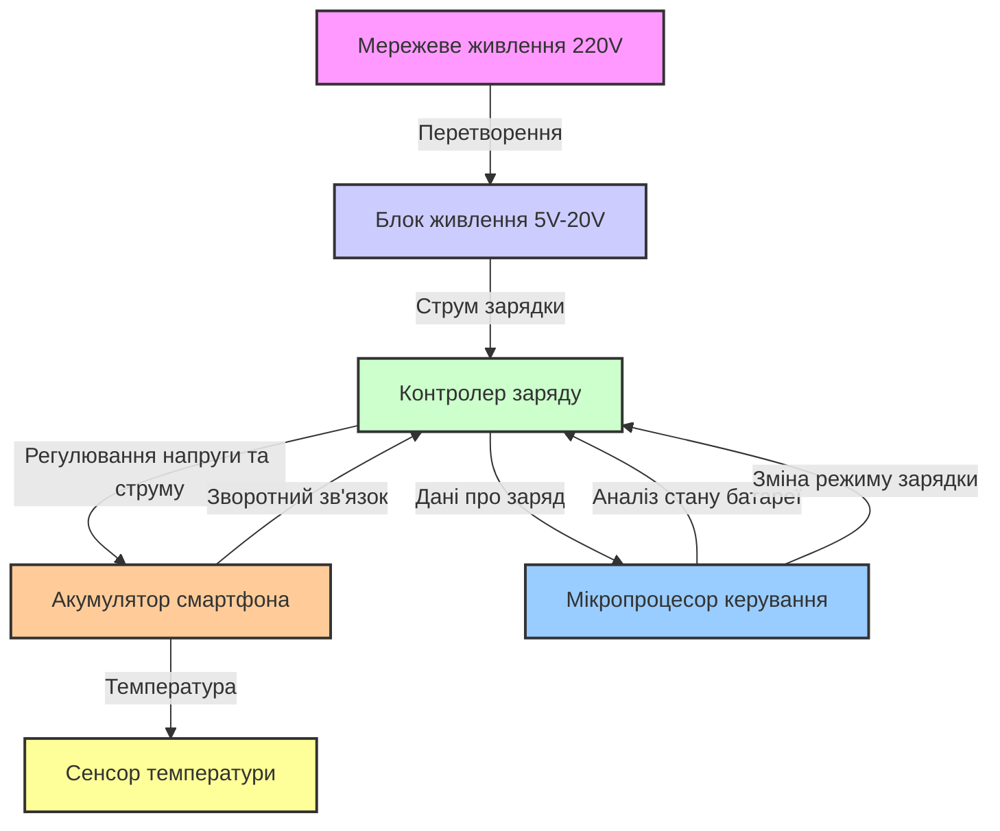
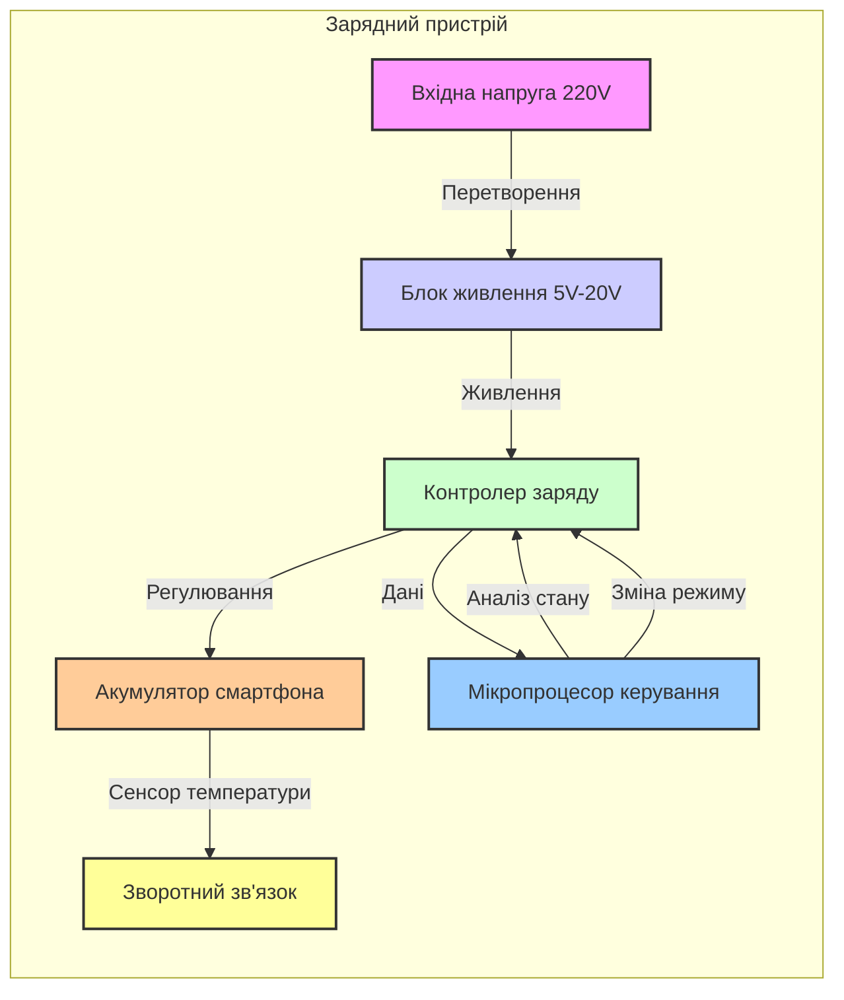

<!-- 
1. Ознайомитись з теоретичними відомостями
(див.метод. вказівки у прикріпленому файлі)
2. Вивчити та описати в загальному вигляді
природу технологічного об’єкту керування (ОК) і процеси, що протікають в ньому.
3. Визначити та описати регульовані параметри,
збурення і можливі дії керування.
4. Скласти параметричну схему ОК із вказанням
фізичних величин вхідних та вихідних сигналів і збурюючих впливів.
5. Скласти структурну схему системи керування та
описати її роботу в загальному вигляді.
6. Зробити висновки по роботі та дати відповіді
на контрольні питання (див.метод. вказівки у прикріпленому файлі).
7. Оформити звіт згідно вимог (
див.метод. вказівки у прикріпленому файлі). 
-->

Окей, тоді опишемо систему керування зарядкою телефону!  

Зарядний пристрій є типовим технологічним об’єктом керування (ОК), де ключовими параметрами є напруга, струм та температура акумулятора. Далі структуруємо звіт за вимогами:  

1. **Природа технологічного об’єкта керування**  
   - Зарядний пристрій призначений для подачі електроенергії до акумулятора смартфона.  
   - Основні процеси: контроль напруги та струму зарядки, захист від перегріву, автоматичне відключення після повного заряду.  

2. **Регульовані параметри, збурення та можливі дії керування**  
   - **Регульовані параметри:** напруга (V), струм (A), температура батареї (°C).  
   - **Збурення:** коливання напруги в електромережі, стан акумулятора (зношеність), зовнішня температура.  
   - **Дії керування:** зміна сили струму, відключення при перегріві, перемикання між режимами (швидка або звичайна зарядка).  

3. **Параметрична схема ОК**  
   - Вхідні сигнали: мережева напруга (~220V), зарядний струм (5V–20V залежно від стандарту).  
   - Вихідні сигнали: рівень заряду батареї, температура, струм споживання.  
   - Збурюючі впливи: температурні зміни, коливання напруги.  

4. **Структурна схема системи керування**  
   - Система містить блок живлення, контролер заряду, сенсори температури та рівня заряду, мікропроцесор, який змінює напругу та струм відповідно до стану акумулятора.  

5. **Висновки та відповіді на контрольні питання**  
   - Система автоматичного керування зарядкою дозволяє підвищити ефективність зарядного процесу, забезпечити безпеку та продовжити термін служби акумулятора.  

